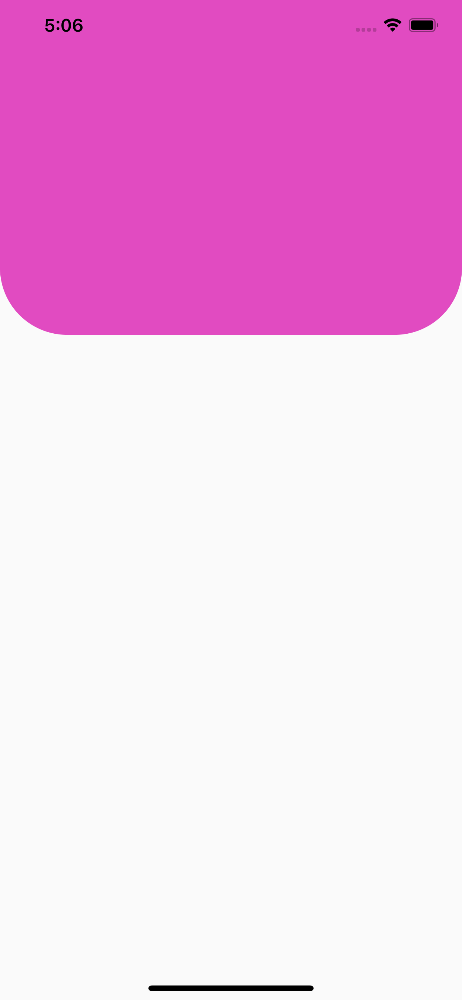
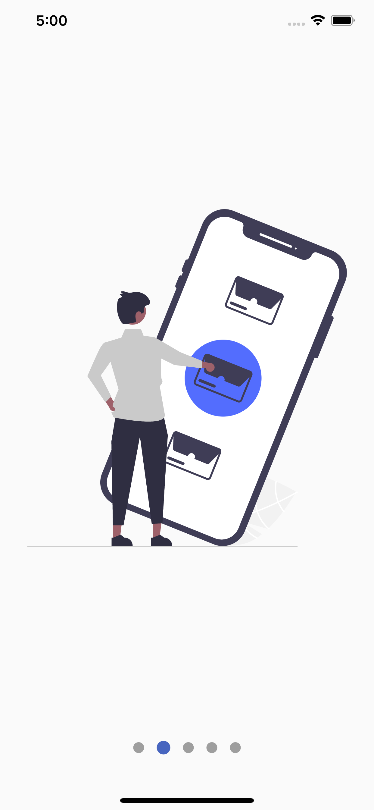
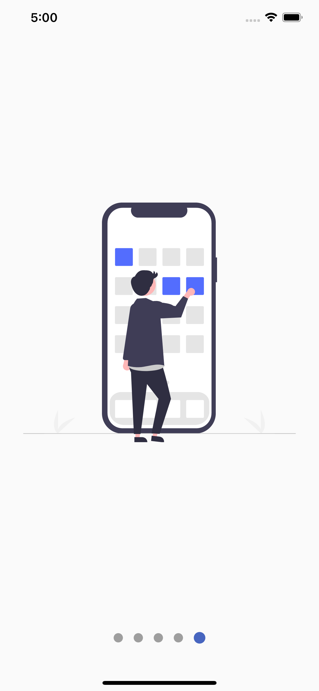

# designs

A new Flutter project.

## Getting Started

This project is a starting point for a Flutter application.

A few resources to get you started if this is your first Flutter project:

- [Lab: Write your first Flutter app](https://flutter.dev/docs/get-started/codelab)
- [Cookbook: Useful Flutter samples](https://flutter.dev/docs/cookbook)

For help getting started with Flutter, view our
[online documentation](https://flutter.dev/docs), which offers tutorials,
samples, guidance on mobile development, and a full API reference.

## Screen view
- Animation

  
 
 
 
- Headers

  
  
  
  
  
  
  
  

- Charts

   

- Slide Show Page

 
 
 
 
 

- PinterestPage

   

- Animated button list

   

